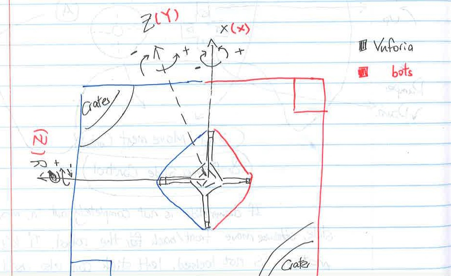
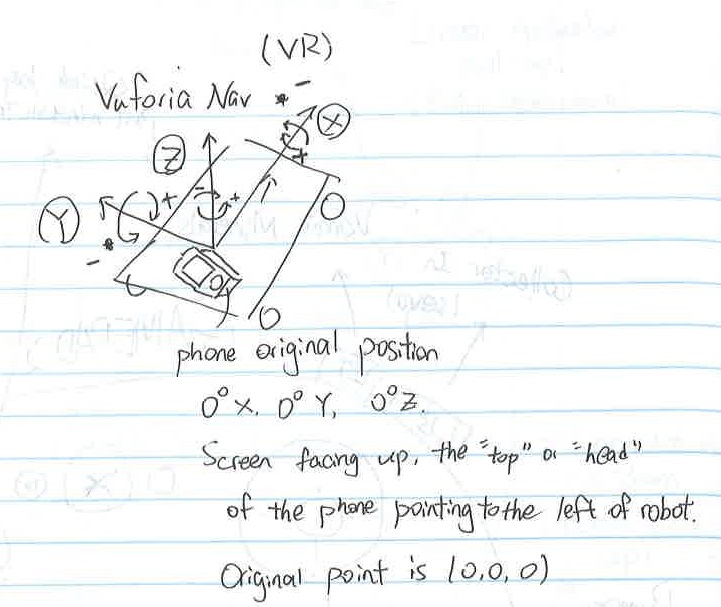
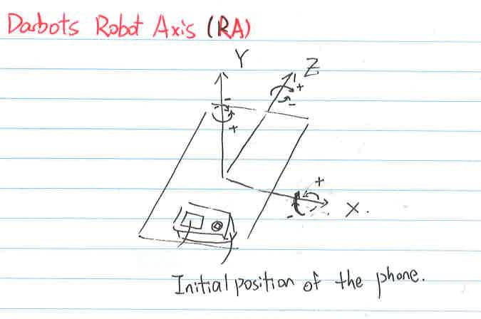
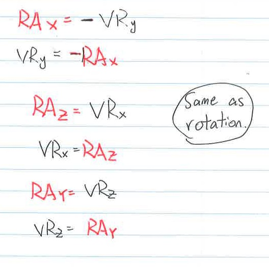

# 2018 Rover-Ruckus Game Shared Document.

This is the shared document for 2018 First Tech Challange Rover-Rukus game.

## Field Definition

### Size

The field is 12ft &times; 12ft.   
As we are using the centimeter unit, it is expressed as $ 365.76 \times 365.76 cm^2 $

### Orientation

The Origin of the field is located on the center of the field. The Z axis goes to the blue alliance side while the X axis goes to the blue alliance crater / red alliance depot.

### Vuforia Navigation

#### Field Convertions

#### Robot Convertions

