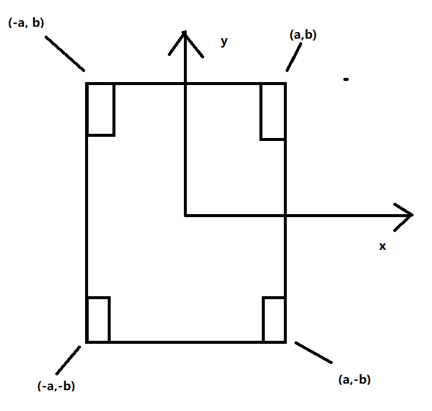

# FTC SharedLib
FTC SharedLib is an opensource library written by David Cao primarily for the ease of development of the FTC competition softwares.  
## Classes
### Position Tracker
Position tracker is a big deal of the FTC SharedLib. In theory it gives an accurate and adjustable position of the robot integrated by the software code. Here I will be explaining a few key concepts of the position tracker.  
#### Axies
The Position Tracker implements two sets of coordinate system. The field axis and the robot axis. 
##### Field Axis
The field axis demonstrates the absolute point on the field where robot is, as this image shows.  
  
The Origin and the Orientation of the x, y axis is defined by the programmer, but should be fixed after the decision.  
When talking about rotation around the field axis, 0 degrees means the robot is pointing to the Y axis. Positive number means to rotate clockwise with respect to the Y axis.  
##### Robot Axis
The Robot Axis represents the point relative to the robot. It can be used to demonstrate the position of the sensor installed on the robot. The x and y value of the robot axis coordinate does not change if the robot moves, rotates.  
  
The origin and the orientation of the x, y axis is defined by the programmer.  
In common cases, the origin is the center of the robot while the y axis is pointing toward the front of the robot.  
When talking about rotation around the robot axis, 0 degrees means the robot is pointing to the robot Y axis, positive number means to rotate clockwise with respect to the robot Y axis.  
##### RobotExtremes
RobotExtremes are the 4 points on the robot where they get the most negative/positive x and y values. Those 4 points should be a rigid body on the robot that involves collision and is used to calculate the collision of the robot on the field wall, so that when a collision happens to the robot with the field wall, the X and Y values are adjusted according to those points.  
  
In this example, the robot extremes in the image is `(-a,b)`, `(a,b)`,`(-a,-b)` and `(a,-b)`  
### RobotEventLoopable
EventLoopable is a very important interface in the development of FTC software. It gives every java class the ability to execute a segment of code during every loop of the robotcontroller.  
RobotEventLoopable is used in `RobotNonBlockingMotor`, `RobotNonBlockingNoEncoderMotor`, `RobotDebugger`, `RobotMotionSystem`, `RobotNonBlockingWheel`, `RobotNonBlockingNoEncoderWheel`, `RobotPositionTracker`.  
**It is just important for you to know that you need to execute `CLASS.doLoop()` if one class implements a `RobotEventLoopable`.**  
### RobotNonBlockingMotor
`RobotNonBlockingMotor` gives an precise and non-blocking method of controlling ENCODER-ATTACHED motors. It gives the programmer both the ability to let the motor go through a fixed number of rotation and to let the motor go with a fixed speed, while letting the programmer able to read the counts moved from the motor. It also automatically detects failure to move and stops the motor from breaking its gears.  
To initialize the motor, you need to know how many `CountsPerRev`, `RevPerSecond` the motor has. To be able to access this information, I already made a list giving [those specifications](https://github.com/DarlingtonProgramming/DarBots/wiki/Darbots-Motor-Specifications). You just have to match the motor up with the list and you are good.  
### RobotNonBlockingNoEncoderMotor
`RobotNonBlockingNoEncoderMotor` gives a not-precise but non-blocking method of controlling motors that are NOT encoder-attached. It gives the programmer the ability to let the motor go through a fixed number of rotation and to let the motor go with a fixed speed, while letting the programmer able to read the approximate number of counts moved. It is implemented by using chronological integration where RevPerSecond specifications are required to be really accurate.  
Same as the `RobotNonBlockingMotor`, you need to know the `CountsPerRev` and `RevPerSecond` specification of the motor you are using.  
