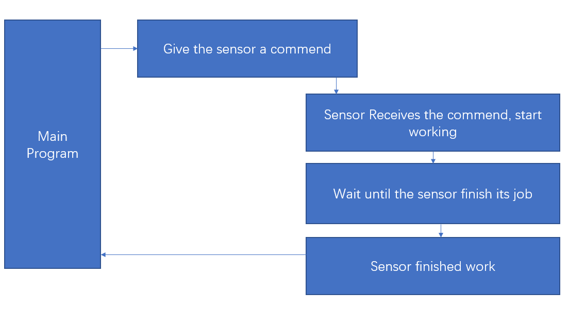
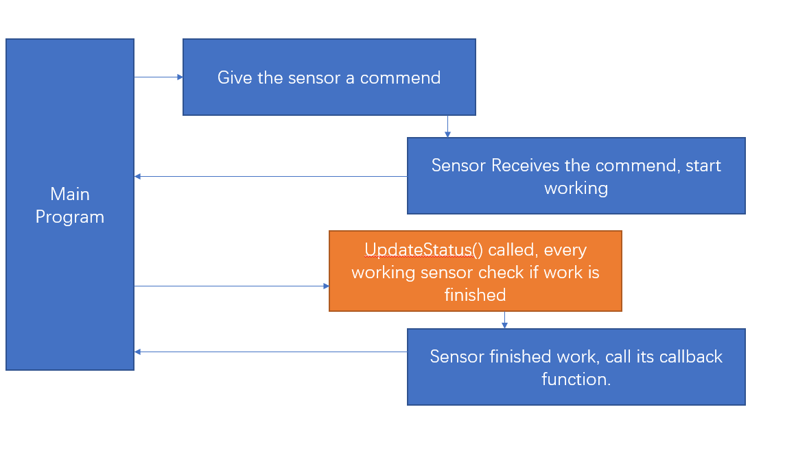

# [Darbots FTC SharedLib](https://github.com/DarlingtonProgramming/FTC-Darbots-SkyStone)

Darbots FTC SharedLib is an opensource library written by David Cao primarily for the ease of development of the FTC competition softwares.   
To view the code, see [Our Repository](https://github.com/DarlingtonProgramming/FTC-Darbots-SkyStone)   

## Major advantages

1. Encoder + Gyro Guided + Steadily Speeding Up Autonomous X / Z Axis Movements with even fewer lines than native FTC codes.
2. Position Tracker based on encoder + Vuforia.
3. Wrapped up season game element recognition classes. (Both Tensorflow Skystone Recognition + Vuforia Skystone Recognition)
4. Prevention of DC Motor from stalling by adding a time limit to each motor movement
5. Ability to use DC Motor as a servo (through encoders)
6. Easy Logging functionalities.
7. Ability to store informations on phone.

## Tech Side

The `Darbots FTC Shared Lib` is established on asynchronous idea - no action on the robot blocks the execution of the code flow unless the programmer instructs to do so.   

This library has went through 4 iterations and this is the official document for the 4th iteration.   

The `Darbots FTC Shared Lib` used `Divide and Conquer` theory to establish a truly comprehensive solution to FTC programming. Instead of writing codes in a single java class, we divide sensors, calculations and specific mechanisms into separate java classes, and organize the robot's controlling code into a class called `RobotCore`, which both Autonomous and TeleOp OpModes can use those collaborating modules through initializing a single `RobotCore` class. `Divide and Conquer` gives us many advantages such as communication between parts, ease of debugging and more fallback mechanisms.   

### Compare and contrast

|FTC Native Code|Darlington Shared Library Code|
|-|-|
|Cannot read rotations that a non-encoder attached motor went through|Can read approximations based on motor specifications|
|No unique control over chassises & usually the movement is controlled by time duration|Unique control over different chassises & controlled by encoder readings|
|No safety mechanism on linear slides, lifting devices, etc. |3 **unique** approaches combining hardware and software to prevent hardware failure|
|No collaboration between parts, usually drivers manually move different modules to get out of the way of another module|Automated java class arranges the collaboration of parts|
|Blocking code flow structure|Asynchronous code flow structure|
|No position tracking software once lost navigation target|Encoder values calculation using `Robot2DPositionTracker` + vuforia navigation implemention|
|Different code of mineral sampling between webcam and phone|Both webcam and phone abstracted into `RobotCamera`, sampling function class accepts the abstract class as a parameter|
|Debugger difficulty|Global static class registers the telemetry and helps modules to easily register debug informations|
|Combo key that requires ordered movemnets usually blocks all controls|Combo key can be performed while other parts are allowed to move|

### Async and Code Structures
In deciding whichever structure to use for our sharedlib, we choosed asynchronous. Compared to traditional FTC controlling softwares, asynchronous structure gives more possible action numbers in a fixed CPU time. Compared to multithreading, it gives programmers no potential problem about thread lock and shared memories. Here is a graph demonstration that helps you to get a better understanding of how asynchronous code structure works.   

A traditional RC Code Structure always wait for a sensor to finish its job before executing other tasks and even if people think of asynchronous code in native FTC code, the code just looks awful.   

The async coding structure gives programmer the freedom to go back to the next code segment as long as the sensor recieved the order to perform a task. It does not wait for the sensor to finish, but programmers are asked to constantly call UpdateStatus() method to let the sensor to check whether its work is finished. Our library also gives a callback mechanism that allows code to be automatically executed after the sensor performed its job.   

For the code structure, the library gives us a clearer understanding of autonomous and teleop codes.   

After the comparison between native codes and the library codes, we can probably conclude that the library is more powerful and easier to code with.   

## Understand the two axises

In order for the library to connect the building part and the programming part, we have to put parameters into the program. One of the most important parameters to understand is the two axises.
The two axies use the same basic class `Robot2DPositionIndicator` and `Robot3DPositionIndicator` to illustrate their datas.   

Usually `Robot2DPositionIndicator` is used more often.   

See [Angles and Coordinates Definition](../standardization/Angles_And_Coordinates.md)   

## The basis of Async - RobotNonBlockingDevice

The `RobotNonBlockingDevice` is a java interface that standardizes all the behaviors of sensors that requires time to perform its job. It has three methods. `isBusy()`, which tells if the sensor has been assigned any work to do. `updateStatus()`, which lets the sensor check if the work is done. and `waitUntilFinish()` that gives programmer the ability to let the code to wait for the sensor to finish detecting before the next line of code gets executed.   

## Connecting Motors to the program - RobotMotorType

`RobotMotorType` is an java abstract class that gives a standardized interface for MotorControllers to get the specifications of motors. The specifications stored in `RobotMotorType` include `CountsPerRev`, the number of channel rises for the motor to turn one cycle, `RevolutionPerSecond`, the number of cycles the motor can go through in one second.

## Uniformly control encoder-attached motors and no-encoder attached motors - RobotMotor

`RobotMotor` is an interface that standardizes all motor behaviors and gives programmers the ability to let some motion parts to be encoder-optional. `RobotMotorWithEncoder` uses encoder values for its speed control, position readings and etc while `RobotMotorWithoutEncoder` uses motor specifications in `RobotMotorType` to calculate rotations the motor went through.

## Smooth motion, right now - RobotMotorController

`RobotMotorController` is a java class that gives the `RobotMotor` the ability to run tasks and automatically queue up tasks. It accepts `RobotMotorTask` implementions to be put into its task list and gives callback ability to tasks getting executed.

## RobotMotionSystem - the fundemental base of treating every chassis equally!

`RobotMotionSystem` is a java abstract class that gives uniform control over chassis, it also have the ability to queue up motion tasks for the robot motion system. It also put motors' encoder values into the `Robot2DPositionTracker` class.

## Robot2DPositionTracker - Where am I?

`Robot2DPositionTracker` is a class where our team put consideration of Mathematics into our programming. Its input values are automatically feed by `RobotMotionSystem`, and programmers only need to read its values.

