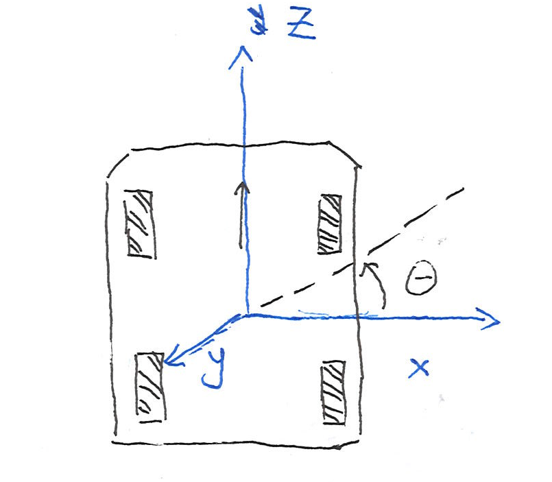

# [Darbots FTC SharedLib](https://github.com/DarlingtonProgramming/DarBots/tree/master/TeamCode/src/main/java/org/firstinspires/ftc/teamcode/DarlingtonSharedLib)

FTC SharedLib is an opensource library written by David Cao primarily for the ease of development of the FTC competition softwares.  

## Centural Focus

The `Darbots FTC Shared Lib` is established on asynchronous idea - no action on the robot blocks the execution of the code flow unless the programmer instructs to do so.   
This library has went through 4 iterations and this is the official document for the 4th iteration.   

The `Darbots FTC Shared Lib` used `Divide and Conquer` theory to establish a truly comprehensive solution to FTC programming. Instead of writing codes in a single java class, we divide sensors, calculations and specific mechanisms into separate java classes, and manage to organize a robot's controlling code into a class called `RobotCore`, which both Autonomous and TeleOp OpModes can use those collaborating modules through initializing a single `RobotCore` class. `Divide and Conquer` gives us many advantages such as communication between parts, ease of debugging and more fallback mechanisms.   

### Compare and contrast

|FTC Native Code|Darlington Shared Library Code|
|-|-|
|Cannot read rotations that a non-encoder attached motor went through|Can read approximations based on motor specifications|
|No unique control over chassises & usually the movement is controlled by time duration|Unique control over different chassises & controlled by encoder readings|
|No safety mechanism on linear slides, lifting devices, etc. |3 **unique** approaches combining hardware and software to prevent hardware failure|
|No collaboration between parts, usually drivers manually move different modules to get out of the way of another module|Automated java class arranges the collaboration of parts|
|Blocking code flow structure|Asynchronous code flow structure|
|No position tracking software once lost navigation target|Encoder values calculation using `Robot2DPositionTracker` + vuforia navigation implemention|
|Different code of mineral sampling between webcam and phone|Both webcam and phone abstracted into `RobotCamera`, sampling function class accepts the abstract class as a parameter|
|Debugger difficulty|Global static class registers the telemetry and helps modules to easily register debug informations|


### Async and Code Structures
In deciding whichever structure to use for our sharedlib, we choosed asynchronous. Compared to traditional FTC controlling softwares, asynchronous structure gives more possible action numbers in a fixed CPU time. Compared to multithreading, it gives programmers no potential problem about thread lock and shared memories. Here is a graph demonstration that helps you to get a better understanding of how asynchronous code structure works.


In this demonstration, a traditional RC Code Structure always wait for a sensor to finish its job before executing other tasks and even if people think of asynchronous code in native FTC code, the code just looks awful. Here is an exmaple.

```java
package org.firstinspires.ftc.teamcode.RobotControllers.Robot4100LeagueTournamentCode;

import com.qualcomm.robotcore.eventloop.opmode.Autonomous;
import com.qualcomm.robotcore.eventloop.opmode.Disabled;
import com.qualcomm.robotcore.eventloop.opmode.LinearOpMode;
import com.qualcomm.robotcore.hardware.CRServo;
import com.qualcomm.robotcore.hardware.DcMotor;
import com.qualcomm.robotcore.hardware.DcMotorSimple;
import com.qualcomm.robotcore.hardware.IrSeekerSensor;
import com.qualcomm.robotcore.hardware.Servo;
import com.qualcomm.robotcore.hardware.TouchSensor;
import com.qualcomm.robotcore.util.ElapsedTime;

import org.firstinspires.ftc.robotcontroller.external.samples.SensorREVColorDistance;
import org.firstinspires.ftc.robotcore.external.ClassFactory;
import org.firstinspires.ftc.robotcore.external.hardware.camera.WebcamName;
import org.firstinspires.ftc.robotcore.external.navigation.VuforiaLocalizer;
import org.firstinspires.ftc.robotcore.external.tfod.Recognition;
import org.firstinspires.ftc.robotcore.external.tfod.TFObjectDetector;
import org.firstinspires.ftc.teamcode.RobotControllers.DarbotsPrivateInfo.PrivateSettings;

import java.util.List;

/**
 * Created by iwu on 4/10/18.
 */

@Autonomous (name = "TM_AWithoutTM", group = "4100")
//@Disabled

public class TM_AWithoutTM extends LinearOpMode {

    DcMotor frontleft, frontright, backleft, backright, lift, slides, collector, dump;
    Servo  bucket, teammark;
    TouchSensor maxSlide, minSlide;
    private ElapsedTime     runtime = new ElapsedTime();


    static final double     COUNTS_PER_MOTOR_REV    = 1120 ;
    static final double     Motor_GEAR_REDUCTION    = 0.5 ;
    static final double     WHEEL_DIAMETER_INCHES   = 4.0 ;
    static final double     COUNTS_PER_INCH         = (COUNTS_PER_MOTOR_REV * Motor_GEAR_REDUCTION) / (WHEEL_DIAMETER_INCHES * 3.1415);
    static final double     TURN_SPEED              = 0.5;
    private static final String TFOD_MODEL_ASSET = "RoverRuckus.tflite";
    private static final String LABEL_GOLD_MINERAL = "Gold Mineral";
    private static final String LABEL_SILVER_MINERAL = "Silver Mineral";

    private static final String VUFORIA_KEY = PrivateSettings.VUFORIALICENSE;

    private VuforiaLocalizer vuforia;

    private TFObjectDetector tfod;
    private int key = -1;

    @Override
    public void runOpMode() {
        hardwareInitialize();
        initVuforia();
        bucket.setPosition(0.8);
        teammark.setPosition(0.6);

        if (ClassFactory.getInstance().canCreateTFObjectDetector()) {
            initTfod();
        } else {
            telemetry.addData("Sorry!", "This device is not compatible with TFOD");
        }

        /** Wait for the game to begin */
        telemetry.addData(">", "Press Play to start tracking");
        telemetry.update();

        waitForStart();
        teammark.setPosition(0.8);
        bucket.setPosition(0.8);
        if (opModeIsActive() ) {
            if (tfod != null) {
                tfod.activate();
                runtime.reset();
            }

            while (opModeIsActive() && runtime.seconds()<2) {
                if (tfod != null) {

                    List<Recognition> updatedRecognitions = tfod.getUpdatedRecognitions();
                    if (updatedRecognitions != null) {
                        telemetry.addData("# Object Detected", updatedRecognitions.size());
                        if (updatedRecognitions.size() == 2) {
                            int goldMineralX = -1;
                            int silverMineral1X = -1;
                            int silverMineral2X = -1;
                            for (Recognition recognition : updatedRecognitions) {
                                if (recognition.getLabel().equals(LABEL_GOLD_MINERAL)) {
                                    goldMineralX = (int) recognition.getLeft();
                                } else if (silverMineral1X == -1) {
                                    silverMineral1X = (int) recognition.getLeft();
                                } else {
                                    silverMineral2X = (int) recognition.getLeft();
                                }
                            }
                            if ((goldMineralX != -1 && silverMineral1X != -1) || (silverMineral2X != -1 && silverMineral1X != -1)) {
                                if (goldMineralX == -1 && silverMineral1X != -1) {
                                    key = 2;
                                    telemetry.addData("Gold Mineral Position", "Right" + key);
                                } else if ((goldMineralX != -1 && silverMineral1X !=-1)&&(goldMineralX < silverMineral1X)) {
                                    key = 0;
                                    telemetry.addData("Gold Mineral Position", "Left" + key);
                                } else {
                                    key = 1;
                                    telemetry.addData("Gold Mineral Position", "Center" + key);
                                }
                            }
                        }
                        telemetry.update();
                    }
                }
            }
        }

        if (tfod != null) {
            tfod.shutdown();
        }

        WeakDescend();
        if (tfod != null) {
            tfod.shutdown();
        }

        weakChugou();
        sleep(500);


        switch (key) {
            case (0):
                telemetry.addLine("zuo");
                telemetry.update();
                encoderDrive(0.6,26,26,5);
                sleep(50);
                encoderDriveCe(0.3,-27,27,5);
                sleep(50);
                encoderDrive(0.5,47,47,5);
                sleep(50);
                encoderDrive(0.3,-5,-5,2);
                sleep(50);
                encoderDrive(0.3,24,-24,5);
                sleep(50);
                encoderDrive(0.3,24,24,5);
                sleep(250);
                encoderDriveCe(0.3,-15,15,5);
                teammark.setPosition(0);
                sleep(500);
                teammark.setPosition(0.8);
                encoderDrive(0.5,14,-14,5);
                sleep(250);
                encoderDriveCe(0.3,-15,15,3);
                sleep(50);
                encoderDrive(0.3,30,30,5);
                bucket.setPosition(0);
                stop();

                break;
            case (1):
                telemetry.addLine("zhong");
                telemetry.update();
                encoderDrive(0.5,90,90,8);
                sleep(50);
                encoderDrive(0.5,-6,-6,3);
                sleep(50);
                encoderDrive(0.5, 41,-41,5);
                sleep(50);
                encoderDrive(0.5,-14,-14,2);
                sleep(50);
                teammark.setPosition(0);
                sleep(500);
                teammark.setPosition(0.8);
                encoderDrive(0.5,18,18,3);
                sleep(250);
                encoderDriveCe(0.3,-12,12,3);
                encoderDrive(0.7,45,45,5);
                sleep(250);
                encoderDriveCe(0.3,-15,15,3);
                sleep(50);
                encoderDrive(0.7,50,50,5);
                bucket.setPosition(0);
                stop();

                break;
            case (2):
                telemetry.addLine("you");
                telemetry.update();
                encoderDrive(0.6,25,25,5);
                sleep(50);
                encoderDriveCe(0.3,22,-22,5);
                sleep(50);
                encoderDrive(0.5,47,47,5);
                sleep(50);
                encoderDrive(0.3,-5,-5,2);
                sleep(50);
                encoderDrive(0.3,40,-40,5);
                sleep(50);
                encoderDrive(0.3,-32,-32,2);
                sleep(50);
                teammark.setPosition(0);
                sleep(500);
                teammark.setPosition(0.8);
                encoderDrive(0.3,18,18,3);
                sleep(250);
                encoderDriveCe(0.3,-7,7,3);
                sleep(50);
                encoderDrive(0.7,55,55,5);
                sleep(250);
                encoderDriveCe(0.3,-7,7,3);
                encoderDrive(0.7,42,42,5);
                bucket.setPosition(0);

                stop();

                break;
            case (-1):
                telemetry.addLine("default");
                telemetry.update();
                encoderDrive(0.5,90,90,8);
                sleep(50);
                encoderDrive(0.5,-6,-6,3);
                sleep(50);
                encoderDrive(0.5, 41,-41,5);
                sleep(50);
                encoderDrive(0.5,-14,-14,2);
                sleep(50);
                teammark.setPosition(0);
                sleep(500);
                teammark.setPosition(0.8);
                encoderDrive(0.5,18,18,3);
                sleep(250);
                encoderDriveCe(0.3,-12,12,3);
                encoderDrive(0.7,45,45,5);
                sleep(250);
                encoderDriveCe(0.3,-15,15,3);
                sleep(50);
                encoderDrive(0.7,50,50,5);
                bucket.setPosition(0);
                stop();
                break;

        }

        sleep(3000);
        ka();

        bucket.setPosition(1.0);
        stop();
    }


    void hardwareInitialize(){
        frontleft = hardwareMap.dcMotor.get("FL");
        frontright = hardwareMap.dcMotor.get("FR");
        backleft = hardwareMap.dcMotor.get("BL");
        backright = hardwareMap.dcMotor.get("BR");

        frontleft.setMode(DcMotor.RunMode.STOP_AND_RESET_ENCODER);
        frontright.setMode(DcMotor.RunMode.STOP_AND_RESET_ENCODER);
        backleft.setMode(DcMotor.RunMode.STOP_AND_RESET_ENCODER);
        backright.setMode(DcMotor.RunMode.STOP_AND_RESET_ENCODER);

        frontleft.setMode(DcMotor.RunMode.RUN_USING_ENCODER);
        frontright.setMode(DcMotor.RunMode.RUN_USING_ENCODER);
        backleft.setMode(DcMotor.RunMode.RUN_USING_ENCODER);
        backright.setMode(DcMotor.RunMode.RUN_USING_ENCODER);


        lift = hardwareMap.dcMotor.get("lift");

        collector = hardwareMap.dcMotor.get("collector");
        slides = hardwareMap.dcMotor.get("slides");
        bucket = hardwareMap.servo.get("bucket");
        teammark = hardwareMap.servo.get("tm");

        minSlide = hardwareMap.touchSensor.get("minSlide");
        maxSlide = hardwareMap.touchSensor.get("maxSlide");

        dump = hardwareMap.dcMotor.get("dump");

        slides.setDirection(DcMotor.Direction.REVERSE);
        frontright.setDirection(DcMotor.Direction.REVERSE);
        backright.setDirection(DcMotor.Direction.REVERSE);
        lift.setDirection(DcMotor.Direction.REVERSE);

    }

    public void WeakDescend(){
        lift.setPower(1.0);
        sleep(6800);
        lift.setPower(0);
    }


    //
    public void ka(){
        frontleft.setPower(0);
        backleft.setPower(0);
        frontright.setPower(0);
        backright.setPower(0);
        sleep(500);
    }


    public void encoderDriveCe(double speed,
                               double leftInches, double rightInches,
                               double timeoutS) {
        int newLeftTarget;
        int newRightTarget;

        if (opModeIsActive()) {

            newLeftTarget = frontleft.getCurrentPosition() + (int)(leftInches * COUNTS_PER_INCH);
            newRightTarget = frontright.getCurrentPosition() + (int)(rightInches * COUNTS_PER_INCH);
            frontleft.setTargetPosition(newLeftTarget);
            backright.setTargetPosition(newLeftTarget);
            frontright.setTargetPosition(newRightTarget);
            backleft.setTargetPosition(newRightTarget);

            frontleft.setMode(DcMotor.RunMode.RUN_TO_POSITION);
            backright.setMode(DcMotor.RunMode.RUN_TO_POSITION);
            frontright.setMode(DcMotor.RunMode.RUN_TO_POSITION);
            backleft.setMode(DcMotor.RunMode.RUN_TO_POSITION);

            runtime.reset();
            frontleft.setPower(Math.abs(speed));
            backright.setPower(Math.abs(speed));
            frontright.setPower(Math.abs(speed));
            backleft.setPower(Math.abs(speed));

            while (opModeIsActive() &&
                    (runtime.seconds() < timeoutS) &&
                    (frontleft.isBusy() && frontright.isBusy())) {

                telemetry.addData("FL",  "Running to %7d :%7d", newLeftTarget,  newRightTarget);
                telemetry.addData("FR",  "Running at %7d :%7d",
                        frontleft.getCurrentPosition(),
                        frontright.getCurrentPosition());

                telemetry.update();
            }

            frontleft.setPower(0);
            backright.setPower(0);
            frontright.setPower(0);
            backleft.setPower(0);

            frontleft.setMode(DcMotor.RunMode.STOP_AND_RESET_ENCODER);
            frontright.setMode(DcMotor.RunMode.STOP_AND_RESET_ENCODER);
            backleft.setMode(DcMotor.RunMode.STOP_AND_RESET_ENCODER);
            backright.setMode(DcMotor.RunMode.STOP_AND_RESET_ENCODER);

            frontright.setMode(DcMotor.RunMode.RUN_USING_ENCODER);
            frontleft.setMode(DcMotor.RunMode.RUN_USING_ENCODER);
            backleft.setMode(DcMotor.RunMode.RUN_USING_ENCODER);
            backright.setMode(DcMotor.RunMode.RUN_USING_ENCODER);
            //  sleep(250);
        }
    }

    public void encoderDrive(double speed,
                             double leftInches, double rightInches,
                             double timeoutS) {
        int newLeftTarget;
        int newRightTarget;

        if (opModeIsActive()) {

            newLeftTarget = frontleft.getCurrentPosition() + (int)(leftInches * COUNTS_PER_INCH);
            newRightTarget = frontright.getCurrentPosition() + (int)(rightInches * COUNTS_PER_INCH);
            frontleft.setTargetPosition(newLeftTarget);
            backleft.setTargetPosition(newLeftTarget);
            frontright.setTargetPosition(newRightTarget);
            backright.setTargetPosition(newRightTarget);

            frontleft.setMode(DcMotor.RunMode.RUN_TO_POSITION);
            backleft.setMode(DcMotor.RunMode.RUN_TO_POSITION);
            frontright.setMode(DcMotor.RunMode.RUN_TO_POSITION);
            backright.setMode(DcMotor.RunMode.RUN_TO_POSITION);

            runtime.reset();
            frontleft.setPower(Math.abs(speed));
            backright.setPower(Math.abs(speed));
            frontright.setPower(Math.abs(speed));
            backleft.setPower(Math.abs(speed));

            while (opModeIsActive() &&
                    (runtime.seconds() < timeoutS) &&
                    (frontleft.isBusy() && frontright.isBusy())) {

                telemetry.addData("FL",  "Running to %7d :%7d", newLeftTarget,  newRightTarget);
                telemetry.addData("FR",  "Running at %7d :%7d",
                        frontleft.getCurrentPosition(),
                        frontright.getCurrentPosition());

                telemetry.update();
            }

            frontleft.setPower(0);
            backright.setPower(0);
            frontright.setPower(0);
            backleft.setPower(0);

            frontleft.setMode(DcMotor.RunMode.STOP_AND_RESET_ENCODER);
            frontright.setMode(DcMotor.RunMode.STOP_AND_RESET_ENCODER);
            backleft.setMode(DcMotor.RunMode.STOP_AND_RESET_ENCODER);
            backright.setMode(DcMotor.RunMode.STOP_AND_RESET_ENCODER);

            frontright.setMode(DcMotor.RunMode.RUN_USING_ENCODER);
            frontleft.setMode(DcMotor.RunMode.RUN_USING_ENCODER);
            backleft.setMode(DcMotor.RunMode.RUN_USING_ENCODER);
            backright.setMode(DcMotor.RunMode.RUN_USING_ENCODER);

            //  sleep(250);
        }
    }

    public void initVuforia() {

        VuforiaLocalizer.Parameters parameters = new VuforiaLocalizer.Parameters();

        parameters.vuforiaLicenseKey = VUFORIA_KEY;
        parameters.cameraName = hardwareMap.get(WebcamName.class, "Webcam 1");

        vuforia = ClassFactory.getInstance().createVuforia(parameters);
    }

    public void initTfod() {
        int tfodMonitorViewId = hardwareMap.appContext.getResources().getIdentifier(
                "tfodMonitorViewId", "id", hardwareMap.appContext.getPackageName());
        TFObjectDetector.Parameters tfodParameters = new TFObjectDetector.Parameters(tfodMonitorViewId);
        tfod = ClassFactory.getInstance().createTFObjectDetector(tfodParameters, vuforia);
        tfod.loadModelFromAsset(TFOD_MODEL_ASSET, LABEL_GOLD_MINERAL, LABEL_SILVER_MINERAL);
    }

    public void weakChugou(){
        encoderDriveCe(0.3,-5,5,2);
    }
}
```

This is 4100's code for the Northern georgia league tournament. The code just takes millions of years to understand. This is not how java is meant to be, and involves no art in coding. Even though the programmer tried to wrap around some functions, it just makes no sense for us on what the code is doing exactly. And clearly there are no fallback mechanisms.


In this demonstration, the async coding structure gives programmer the freedom to go back to the next code segment as long as the sensor recieved the order to perform a task. It does not wait for the sensor to finish, but programmers are asked to constantly call UpdateStatus() method to let the sensor to check whether its work is finished. Our library also gives a callback mechanism that allows code to be automatically executed after the sensor performed its job.

For the code structure, the library gives us a clearer understanding of autonomous and teleop codes.

```java
package org.firstinspires.ftc.teamcode.RobotControllers.Robot5100Core2018Revision3A;

import com.qualcomm.robotcore.eventloop.opmode.Autonomous;
import com.qualcomm.robotcore.eventloop.opmode.LinearOpMode;
import com.qualcomm.robotcore.util.ElapsedTime;

import org.firstinspires.ftc.teamcode.Darlington2018SharedLib.FTC2018GameSpecificFunctions;
import org.firstinspires.ftc.teamcode.DarlingtonSharedLib.IntegratedFunctions.RobotDebugger;
import org.firstinspires.ftc.teamcode.DarlingtonSharedLib.Templates.RobotDistanceSensor;

@Autonomous(name = "Robot5100Auto-AllPos", group = "5100")
public class Robot5100Auto_AllPos extends LinearOpMode {
    protected Robot5100Core m_RobotCore;
    protected void hardwareInit(){
        this.m_RobotCore = new Robot5100Core(
                false,
                true,
                this,
                100,
                100,
                0,
                0,
                0,
                0
        );
    }
    protected void hardwareDestroy(){
        this.m_RobotCore = null;
    }
    @Override
    public void runOpMode() throws InterruptedException {
        this.hardwareInit();
        RobotDebugger.addDebug("Status","Initialized");
        RobotDebugger.doLoop();
        this.waitForStart();
        if(this.opModeIsActive()){
            this.m_RobotCore.setLinearActuatorToHook(Robot5100Setting.AUTONOMOUS_LINEARACTUATORSPEED);
            while(this.m_RobotCore.isBusy() && this.m_RobotCore.getLinearActuator().getCurrentPercent() < 99  && this.opModeIsActive()){

            }
            this.m_RobotCore.getLinearActuator().stopMotion();
            this.m_RobotCore.getMotionSystem().turnOffsetAroundCenter(30,Robot5100Setting.AUTONOMOUS_BIGGESTDRIVINGSPEED);
            this.m_RobotCore.getMotionSystem().waitUntilFinish();
            //Go forward
            this.m_RobotCore.getMotionSystem().driveForward(10,0.2);
            this.m_RobotCore.getMotionSystem().stopMoving();
            this.m_RobotCore.getMotionSystem().turnOffsetAroundCenter(-35,Robot5100Setting.AUTONOMOUS_BIGGESTDRIVINGSPEED);
            this.m_RobotCore.getMotionSystem().waitUntilFinish();
            this.m_RobotCore.getMotionSystem().driveForward(18,Robot5100Setting.AUTONOMOUS_BIGGESTDRIVINGSPEED);
            this.m_RobotCore.getMotionSystem().waitUntilFinish();
            this.m_RobotCore.getMotionSystem().driveToRight(25,Robot5100Setting.AUTONOMOUS_BIGGESTDRIVINGSPEED);
            this.m_RobotCore.getMotionSystem().waitUntilFinish();
            this.m_RobotCore.getMotionSystem().driveToLeftWithSpeed(0.1);
            ElapsedTime mTime = new ElapsedTime(ElapsedTime.Resolution.SECONDS);
            while(m_Time.seconds() < 10){
                FTC2018GameSpecificFunctions.MineralInformation[] tempInfo = this.m_RobotCore.getGameSpecificFunction().detectAllBlocksInCamera();
                if(FTC2018GameSpecificFunctions.MineralInCenterY(tempInfo).getMineralType() == FTC2018GameSpecificFunctions.MineralType.Gold){
                    break;
                }
            }
            this.m_RobotCore.getMotionSystem().driveForward(30, Robot5100Setting.AUTONOMOUS_BIGGESTDRIVINGSPEED);
            this.m_RobotCore.getMotionSystem().waitUntilFinish();
        }
        //Ending The Autonomous Program
        this.m_RobotCore.getMotionSystem().waitUntilFinish();
        this.m_RobotCore.waitUntilFinish();
        this.m_RobotCore.save();
        this.hardwareDestroy();
    }
}
```

The 5100 Autonomous Code for the league tournament is much easier to understand and did not take much time to finish. 

After the comparison between native codes and the library codes, we can probably conclude that the library is more powerful and easier to code with. 

## Understand the two axises

In order for the library to connect the building part and the programming part, we have to put parameters into the program. One of the most important parameters to understand is the two axises.
The two axies use the same basic class `Robot2DPositionIndicator` and `Robot3DPositionIndicator` to illustrate their datas.   

Usually `Robot2DPositionIndicator` is used more often, and it is extended into `Robot2DPositionFieldAxisIndicator` and `Robot2DPositionRobotAxisIndicator`.

### Field Axis

Field Axis is a coordinate system that is used to indicate a specific point on the field.   


The X, Y and Z axis can be completely determined by the programmer themselves, but inside `Darbots`, they are determined by group discussion at the beginning of the season, and the standards can be found in this repository.   

When the robot is pointing at rotation 0 deg of the field axis, if means the robot Z axis is pointing at the Z axis of the field (the direction of X, Y, Z axis of the field axis and the robot axis should match with each other)

`Robot2DPositionFieldAxisIndicator` and `Robot2DPositionIndicator` can be used to indicate a field axis, a `Robot2DPositionFieldAxisIndicator` is a public class inside `Robot2DPositionTracker`, which means it can only be initialized when a `Robot2DPositionTracker` Object exists. When converting field axis to robot axis, simply use the `toRobotAxis()` method in `Robot2DPositionFieldAxisIndicator`.

### Robot Axis

Robot Axis is a coordinate system that is used to indicate a specific point on the robot or with respect to the robot.   



The Z axis always points to the front of the robot and the X axis always points to the right side of the robot. The origin can be determined by the programmers. Inside `Darbots`, they are determined by group discussion at the beginning of the season, and the standards can be found in this repository.   


When you are initializing a `RobotWheel` class that uses `RobotAxis` as its coordinate system, the rotation of the wheel is the positive counterclockwise angle (or negative clockwise angle) of the wheel shaft with respect to the Z axis.   

## The basis of Async - RobotNonBlockingDevice

The `RobotNonBlockingDevice` is a java interface that standardizes all the behaviors of sensors that requires time to perform its job. It has three methods. `isBusy()`, which tells if the sensor has been assigned any work to do. `updateStatus()`, which lets the sensor check if the work is done. and `waitUntilFinish()` that gives programmer the ability to let the code to wait for the sensor to finish detecting before the next line of code gets executed.   

## Connecting Motors to the program - RobotMotorType

`RobotMotorType` is an java abstract class that gives a standardized interface for MotorControllers to get the specifications of motors. The specifications stored in `RobotMotorType` include `CountsPerRev`, the number of channel rises for the motor to turn one cycle, `RevolutionPerSecond`, the number of cycles the motor can go through in one second.

## Uniformly control encoder-attached motors and no-encoder attached motors - RobotMotor

`RobotMotor` is an interface that standardizes all motor behaviors and gives programmers the ability to let some motion parts to be encoder-optional. `RobotMotorWithEncoder` uses encoder values for its speed control, position readings and etc while `RobotMotorWithoutEncoder` uses motor specifications in `RobotMotorType` to calculate rotations the motor went through.

## Smooth motion, right now - RobotMotorController

`RobotMotorController` is a java class that gives the `RobotMotor` the ability to run tasks and automatically queue up tasks. It accepts `RobotMotorTask` implementions to be put into its task list and gives callback ability to tasks getting executed.

## RobotMotionSystem - the fundemental base of treating every chassis equally!

`RobotMotionSystem` is a java abstract class that gives uniform control over chassis, it also have the ability to queue up motion tasks for the robot motion system. It also put motors' encoder values into the `Robot2DPositionTracker` class.

## Robot2DPositionTracker - Where am I?

`Robot2DPositionTracker` is a class where our team put consideration of Mathematics into our programming. Its input values are automatically feed by `RobotMotionSystem`, and programmers only need to read its values.

